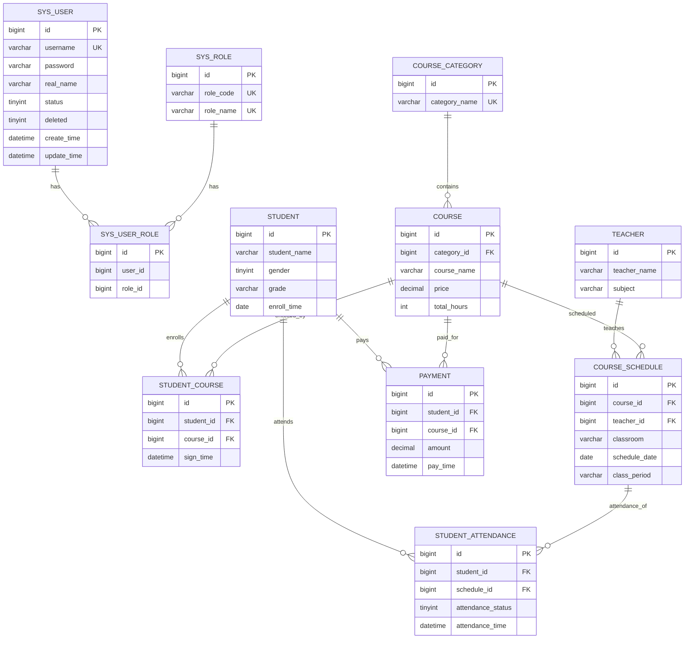
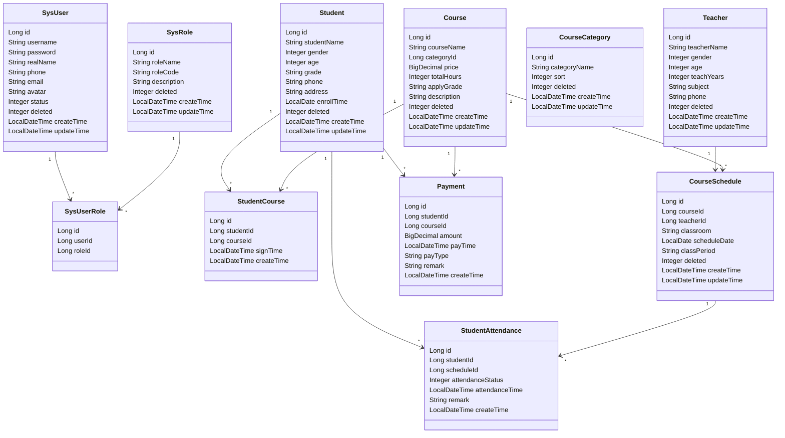

# 实体属性图（ER 图 + 实体类属性图）

> 本文档使用 Mermaid，支持在多数 Markdown 编辑器/Typora/Obsidian/GitLab/GitHub（部分）中渲染。

## 1) ER 图（表关系）

```mermaid
erDiagram
  SYS_USER ||--o{ SYS_USER_ROLE : has
  SYS_ROLE ||--o{ SYS_USER_ROLE : has

  COURSE_CATEGORY ||--o{ COURSE : contains
  STUDENT ||--o{ STUDENT_COURSE : enrolls
  COURSE ||--o{ STUDENT_COURSE : enrolled_by

  TEACHER ||--o{ COURSE_SCHEDULE : teaches
  COURSE ||--o{ COURSE_SCHEDULE : scheduled

  STUDENT ||--o{ PAYMENT : pays
  COURSE ||--o{ PAYMENT : paid_for

  STUDENT ||--o{ STUDENT_ATTENDANCE : attends
  COURSE_SCHEDULE ||--o{ STUDENT_ATTENDANCE : attendance_of

  SYS_USER {
    bigint id PK
    varchar username UK
    varchar password
    varchar real_name
    tinyint status
    tinyint deleted
    datetime create_time
    datetime update_time
  }
  SYS_ROLE {
    bigint id PK
    varchar role_code UK
    varchar role_name UK
  }
  SYS_USER_ROLE {
    bigint id PK
    bigint user_id
    bigint role_id
  }

  STUDENT {
    bigint id PK
    varchar student_name
    tinyint gender
    varchar grade
    date enroll_time
  }
  TEACHER {
    bigint id PK
    varchar teacher_name
    varchar subject
  }
  COURSE_CATEGORY {
    bigint id PK
    varchar category_name UK
  }
  COURSE {
    bigint id PK
    bigint category_id FK
    varchar course_name
    decimal price
    int total_hours
  }
  STUDENT_COURSE {
    bigint id PK
    bigint student_id FK
    bigint course_id FK
    datetime sign_time
  }
  COURSE_SCHEDULE {
    bigint id PK
    bigint course_id FK
    bigint teacher_id FK
    varchar classroom
    date schedule_date
    varchar class_period
  }
  PAYMENT {
    bigint id PK
    bigint student_id FK
    bigint course_id FK
    decimal amount
    datetime pay_time
  }
  STUDENT_ATTENDANCE {
    bigint id PK
    bigint student_id FK
    bigint schedule_id FK
    tinyint attendance_status
    datetime attendance_time
  }
```

## 2) 实体类属性图（后端 Entity）

```mermaid
classDiagram
  class SysUser {
    Long id
    String username
    String password
    String realName
    String phone
    String email
    String avatar
    Integer status
    Integer deleted
    LocalDateTime createTime
    LocalDateTime updateTime
  }
  class SysRole {
    Long id
    String roleName
    String roleCode
    String description
    Integer deleted
    LocalDateTime createTime
    LocalDateTime updateTime
  }
  class SysUserRole {
    Long id
    Long userId
    Long roleId
  }

  class Student {
    Long id
    String studentName
    Integer gender
    Integer age
    String grade
    String phone
    String address
    LocalDate enrollTime
    Integer deleted
    LocalDateTime createTime
    LocalDateTime updateTime
  }
  class Teacher {
    Long id
    String teacherName
    Integer gender
    Integer age
    Integer teachYears
    String subject
    String phone
    Integer deleted
    LocalDateTime createTime
    LocalDateTime updateTime
  }
  class CourseCategory {
    Long id
    String categoryName
    Integer sort
    Integer deleted
    LocalDateTime createTime
    LocalDateTime updateTime
  }
  class Course {
    Long id
    String courseName
    Long categoryId
    BigDecimal price
    Integer totalHours
    String applyGrade
    String description
    Integer deleted
    LocalDateTime createTime
    LocalDateTime updateTime
  }
  class StudentCourse {
    Long id
    Long studentId
    Long courseId
    LocalDateTime signTime
    LocalDateTime createTime
  }
  class CourseSchedule {
    Long id
    Long courseId
    Long teacherId
    String classroom
    LocalDate scheduleDate
    String classPeriod
    Integer deleted
    LocalDateTime createTime
    LocalDateTime updateTime
  }
  class Payment {
    Long id
    Long studentId
    Long courseId
    BigDecimal amount
    LocalDateTime payTime
    String payType
    String remark
    LocalDateTime createTime
  }
  class StudentAttendance {
    Long id
    Long studentId
    Long scheduleId
    Integer attendanceStatus
    LocalDateTime attendanceTime
    String remark
    LocalDateTime createTime
  }

  SysUser "1" --> "*" SysUserRole
  SysRole "1" --> "*" SysUserRole
  Student "1" --> "*" StudentCourse
  Course "1" --> "*" StudentCourse
  Teacher "1" --> "*" CourseSchedule
  Course "1" --> "*" CourseSchedule
  Student "1" --> "*" Payment
  Course "1" --> "*" Payment
  Student "1" --> "*" StudentAttendance
  CourseSchedule "1" --> "*" StudentAttendance
```

