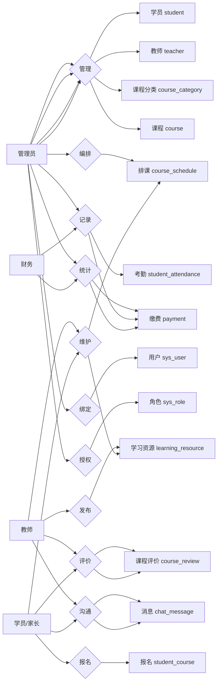
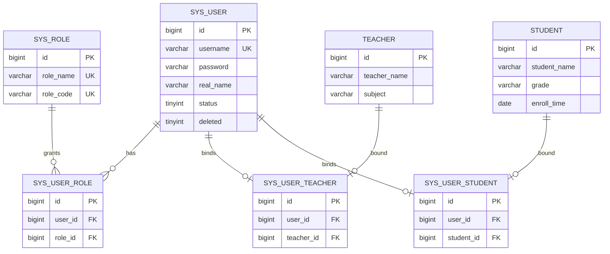
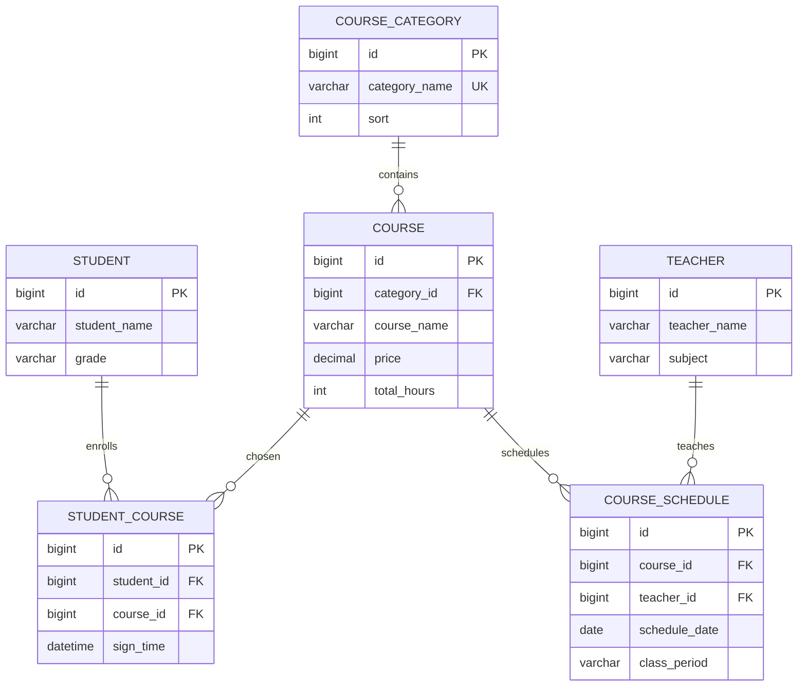
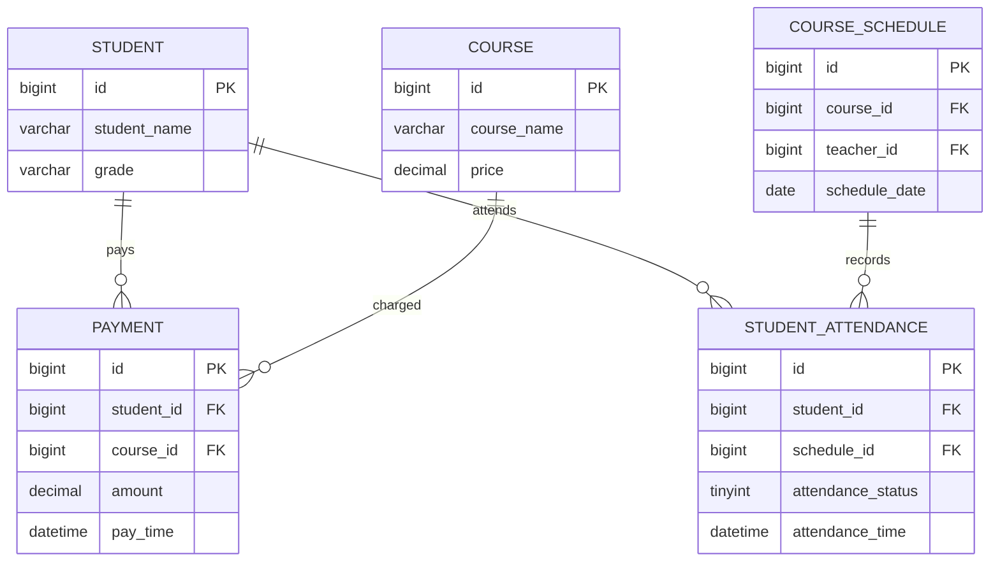
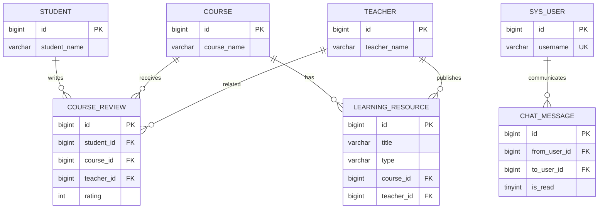

# 整体 ER 图

> 本文档基于 `src/main/resources/sql/schema.sql` 设计，覆盖系统账号、教务业务、财务统计和扩展功能模块。
>  
> 渲染方式：Mermaid，适用于 Typora、Obsidian、GitLab 及支持 Mermaid 的 Markdown 预览器。

## 1. 设计说明

- 系统采用“账号体系”和“业务实体”分离的设计。
- `sys_user` 负责登录认证，`student` 与 `teacher` 负责业务资料。
- 学员和教师都通过绑定表与系统账号建立一对一关系。
- 课程、报名、排课、缴费、考勤构成核心教务链路。
- 评价、学习资源、家校沟通属于扩展业务模块。

## 2. 角色分析与 Chen 风格 ER 图

### 2.1 系统角色（来自 `sys_role`）

- 管理员（`ADMIN`）：维护学员、教师、课程、排课、考勤、统计与账号权限。
- 教师（`TEACHER`）：查看授课排课、发布学习资源、接收评价、沟通消息。
- 财务（`FINANCE`）：管理缴费记录、查看营收统计。
- 学员/家长（`STUDENT`）：报名课程、查看资源、提交评价、家校沟通。

### 2.2 角色驱动的 ER 图（菱形关系风格）

> 这张图按你给的样式绘制：左侧“角色实体”，中间“关系（菱形）”，右侧“业务实体”。

## 3. 分模块 ER 图

### 3.1 账号与权限模块

### 3.2 教务业务模块

### 3.3 财务与考勤模块

### 3.4 扩展功能模块

## 4. 核心关系说明

- `sys_user` 与 `sys_role` 是多对多关系，通过 `sys_user_role` 实现权限分配。
- `sys_user` 与 `teacher` 通过 `sys_user_teacher` 形成一对一绑定。
- `sys_user` 与 `student` 通过 `sys_user_student` 形成一对一绑定。
- `student` 与 `course` 是多对多关系，通过 `student_course` 表示报名关系。
- `course_schedule` 将课程和教师关联起来，用于表示某天某节次的授课安排。
- `payment` 记录学员针对某门课程的缴费情况，可用于营收统计和欠费统计。
- `student_attendance` 基于排课记录学员出勤情况。
- `course_review` 表示学员对课程和教师的评价。
- `learning_resource` 表示教师面向课程发布的作业或学习资料。
- `chat_message` 表示系统用户之间的消息往来，支持家校沟通和通知场景。

## 5. 论文或答辩建议画法

- 如果要画“总图”，建议保留本文这张完整 ER 图。
- 如果要画“分模块图”，建议拆成 4 张：
- 账号权限模块：`sys_user`、`sys_role`、`sys_user_role`、绑定表。
- 教务模块：`student`、`teacher`、`course_category`、`course`、`student_course`、`course_schedule`。
- 财务考勤模块：`payment`、`student_attendance`。
- 扩展功能模块：`course_review`、`learning_resource`、`chat_message`。
