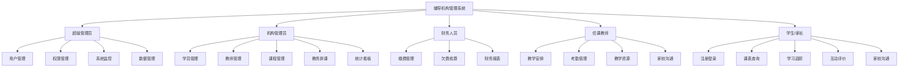
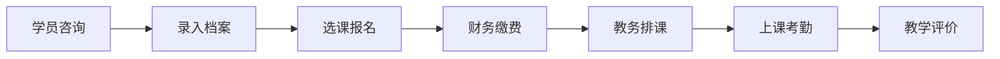
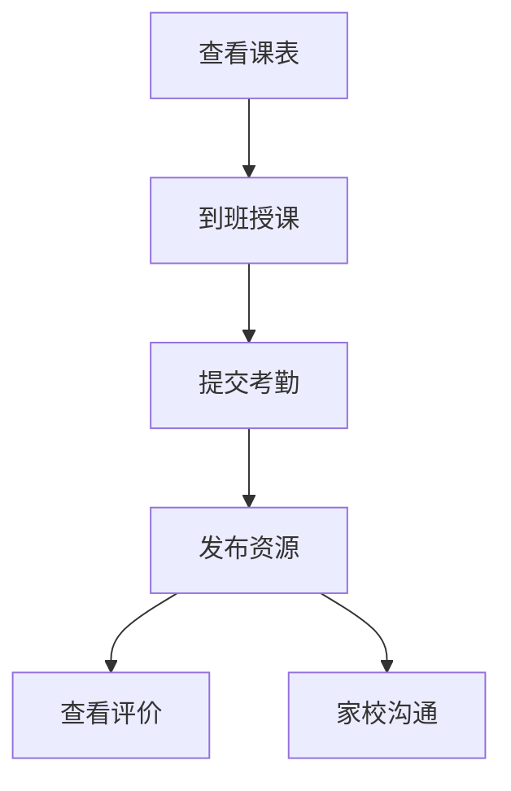
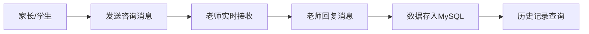

# 辅导机构管理系统 (TMS) 详细分析文档

> 本文档旨在为系统绘图提供详细的逻辑支撑，包含用例图、功能图、实体属性、ER 图、数据库分析、模块设计及流程图。

---

## 1. 各角色用例图分析 (Use Case Analysis)

系统主要分为五大角色：超级管理员、机构管理员、财务人员、教师、学生/家长。所有功能描述均严格控制在 **4个汉字** 以内，便于绘图展示。

### 1.1 超级管理员 (SUPER_ADMIN)
- **用户管理** (include) --> `创建账号`, `禁用账号`, `删除账号`
- **权限管理** (include) --> `角色定义`, `权限分配`
- **系统监控** (include) --> `状态监控`, `日志审计`
- **数据管理** (include) --> `数据备份`, `数据恢复`

### 1.2 机构管理员 (ORG_ADMIN)
- **学员管理** (include) --> `档案录入`, `档案修改`, `年级调整`
- **教师管理** (include) --> `入职登记`, `科目设置`, `档案维护`
- **课程管理** (include) --> `分类维护`, `课程定价`, `课时设置`
- **教务排课** (include) --> `教室分配`, `教师指派`, `时间设置`
- **统计看板** (include) --> `学员分布`, `课程统计`

### 1.3 财务人员 (FINANCE)
- **缴费业务** (include) --> `缴费录入`, `支付记录`
- **欠费核算** (include) --> `欠费统计`, `缴费提醒`
- **财务报表** (include) --> `营收统计`, `营收报表`

### 1.4 任课教师 (TEACHER)
- **教学安排** (include) --> `查看课表`, `课程详情`
- **考勤管理** (include) --> `考勤录入`, `考勤统计`
- **教学资源** (include) --> `发布课件`, `布置作业`, `资料管理`
- **家校沟通** (include) --> `消息发送`, `记录查询`

### 1.5 学生/家长 (STUDENT)
- **个人中心** (include) --> `注册登录`, `信息修改`
- **课表查询** (include) --> `个人课表`, `地点查询`
- **学习追踪** (include) --> `考勤记录`, `资料查看`
- **互动评价** (include) --> `课程评价`, `教师评分`
- **家校沟通** (include) --> `消息发送`, `联系教师`

---

## 2. 系统功能结构图 (Simplified Functional Hierarchy)

---

## 3. 实体属性图 (Entity-Attribute Diagrams)

### 3.1 核心实体属性
- **学员 (Student)**: ID, 姓名, 性别, 年龄, 年级, 手机号, 地址, 入学时间.
- **教师 (Teacher)**: ID, 姓名, 性别, 年龄, 教龄, 擅长科目, 手机号.
- **课程 (Course)**: ID, 课程名, 分类ID, 单价, 总课时, 适用年级, 描述.
- **排课 (Schedule)**: ID, 课程ID, 教师ID, 教室, 日期, 节次.
- **缴费 (Payment)**: ID, 学员ID, 课程ID, 金额, 时间, 支付方式, 备注.
- **聊天消息 (ChatMessage)**: ID, 发送者ID, 接收者ID, 内容, 已读状态, 发送时间.

---

## 4. 系统 ER 图结构分析 (Classic ER Analysis)

> 按照“实体（矩形）- 关系（菱形）- 属性”的经典结构进行梳理，方便您在绘图工具中复刻。

### 4.1 核心实体与属性说明
- **系统用户**: 账号, 密码, 用户名, 头像.
- **教师**: 姓名, 性别, 教龄, 擅长科目.
- **学员**: 姓名, 年级, 手机号, 入学时间.
- **课程**: 课程名, 课程分类, 单价, 总课时.
- **缴费单**: 缴费金额, 支付方式, 缴费时间.
- **排课表**: 教室, 日期, 节次.
- **学习资源**: 标题, 类型, 内容链接.
- **课程评价**: 评分, 评价内容, 评价时间.
- **聊天消息**: 内容, 发送时间, 是否已读.

### 4.2 角色与业务实体关系 (ER 拓扑结构)

#### 1) 教师 (Teacher) 相关的关系
- **教师** -- (1) -- <**发布**> -- (N) -- **学习资源**
- **教师** -- (1) -- <**授课**> -- (N) -- **排课表**
- **教师** -- (1) -- <**被评**> -- (N) -- **课程评价**
- **教师** -- (1) -- <**发送/接收**> -- (N) -- **聊天消息**

#### 2) 学员 (Student) 相关的关系
- **学员** -- (1) -- <**报名**> -- (N) -- **课程**
- **学员** -- (1) -- <**缴纳**> -- (N) -- **缴费单**
- **学员** -- (1) -- <**签到**> -- (N) -- **排课表** (形成考勤记录)
- **学员** -- (1) -- <**发布**> -- (N) -- **课程评价**
- **学员** -- (1) -- <**查看**> -- (N) -- **学习资源**
- **学员** -- (1) -- <**发送/接收**> -- (N) -- **聊天消息**

#### 3) 管理员 (Admin/Finance) 相关的关系
- **管理员** -- (1) -- <**管理**> -- (N) -- **系统用户**
- **管理员** -- (1) -- <**维护**> -- (N) -- **教师/学员/课程**
- **财务人员** -- (1) -- <**审核**> -- (N) -- **缴费单**

### 4.3 整体绘图布局建议
- **左侧**: 系统用户 (SysUser) 分支为不同角色实体（教师、学员、财务、管理员）。
- **中间 (菱形关系层)**: 放置各种动词动作（发布、报名、缴纳、授课、签到等）。
- **右侧 (业务实体层)**: 放置课程、缴费单、排课表、资源、评价等核心数据表。
- **连线标注**: 
    - 角色到关系的连线标注 **1**。
    - 关系到业务实体的连线标注 **N**。

---

## 5. 数据库详细设计

在本设计中，系统的表设计主要包括用户、学员、教师、课程、排课、缴费、聊天记录、课程评价及学习资源等信息表。系统采用关系型数据库 MySQL 进行数据存储，通过合理的表结构设计，确保数据的完整性和一致性。

（1） **用户实体 (SysUser)** 属性涵盖 ID、账号 (username)、密码 (password)、用户名 (real_name)、头像、状态（启用/禁用）、逻辑删除、创建时间及更新时间等。具体结构参考图 3.2 所示。

（2） **教师实体 (Teacher)** 属性设计中，ID、教师姓名、性别、年龄、教龄、擅长科目、联系电话、逻辑删除、创建时间及更新时间均被纳入考虑。具体结构参考图 3.3 所示。

（3） **学员实体 (Student)** 属性包括 ID、学员姓名、性别、年龄、所在年级、家长手机号、家庭地址、入学时间、逻辑删除、创建时间及更新时间。具体结构参考图 3.4 所示。

（4） **课程实体 (Course)** 属性涵盖 ID、课程名称、分类 ID、课程单价（元/课时）、总课时数、适用年级、课程描述、逻辑删除、创建时间及更新时间。具体结构参考图 3.5 所示。

（5） **排课实体 (CourseSchedule)** 属性包括 ID、课程 ID、教师 ID、上课教室、排课日期、上课节次、逻辑删除、创建时间及更新时间。具体结构参考图 3.6 所示。

（6） **缴费实体 (Payment)** 属性分为缴费基本信息与流水记录。属性包括 ID、学员 ID、课程 ID、缴费金额、缴费时间、支付方式（微信/支付宝等）、备注及创建时间。具体结构参考图 3.7 所示。

（7） **聊天消息实体 (ChatMessage)** 属性涵盖 ID、发送者 ID、接收者 ID、消息内容、已读状态（0 否 / 1 是）及发送时间。具体结构参考图 3.8 所示。

### 5.1 数据库表汇总介绍

| 表名 | 作用描述 | 核心字段说明 |
| :--- | :--- | :--- |
| `sys_user` | 存储系统登录账号 | `username`, `password`, `real_name` |
| `sys_role` | 存储角色定义信息 | `role_name`, `role_code` (ADMIN/TEACHER等) |
| `sys_user_role` | 用户与角色的关联 | `user_id`, `role_id` |
| `sys_user_teacher` | 账号与教师实体绑定 | `user_id`, `teacher_id` (1:1 关系) |
| `sys_user_student` | 账号与学生实体绑定 | `user_id`, `student_id` (1:1 关系) |
| `student` | 存储学员基本档案 | `student_name`, `grade`, `phone` |
| `teacher` | 存储教师基本档案 | `teacher_name`, `subject`, `teach_years` |
| `course_category` | 课程所属分类维护 | `category_name`, `sort` |
| `course` | 存储课程元数据 | `course_name`, `price`, `total_hours` |
| `student_course` | 学员报名课程记录 | `student_id`, `course_id`, `sign_time` |
| `course_schedule` | 教务排课时间表 | `classroom`, `schedule_date`, `class_period` |
| `student_attendance`| 学员课堂考勤记录 | `attendance_status` (正常/迟到/缺勤) |
| `payment` | 财务缴费流水记录 | `amount`, `pay_time`, `pay_type` |
| `course_review` | 课程教学质量评价 | `rating` (1-5星), `comment` |
| `learning_resource` | 教学课件与作业资源 | `type` (HOMEWORK/MATERIAL), `content` |
| `chat_message` | 家长与老师沟通记录 | `from_user_id`, `to_user_id`, `content`, `is_read` |

---

## 6. 人员功能模块设计

### 6.1 管理人员 (Admin)
- **档案管理**: 实现学员与教师档案的完整生命周期管理。
- **教务调度**: 负责课程发布、教室指派及自动化排课逻辑。
- **全局监控**: 监控系统运行状态，确保数据备份与安全。

### 6.2 财务人员 (Finance)
- **收费管理**: 负责学员报名的费用核实与实收录入。
- **财务审计**: 自动化统计欠费名单，生成机构营收多维报表。

### 6.3 教学人员 (Teacher)
- **授课中心**: 实时查看个人教学日历，管理名下班级考勤。
- **资源中心**: 针对课程发布数字化教学课件及课后作业。
- **互动沟通**: 通过在线聊天功能与家长保持实时沟通。

### 6.4 学员/家长 (Student)
- **自助中心**: 支持在线注册、档案查看及个人课表实时查询。
- **反馈中心**: 在线查看作业资源，对教学质量进行匿名评价。
- **咨询沟通**: 在线咨询任课老师，反馈孩子学习情况。

---

## 7. 核心业务流程图 (Process Flowcharts)

### 7.1 学员报名排课全链路

### 7.2 教师教学闭环流程

### 7.3 家校沟通互动流程

---

## 8. 总结
本系统通过 `sys_user_student/teacher` 的中间绑定表实现了业务实体与系统账户的解耦，既支持管理员手动录入，也支持用户自主注册并自动绑定。功能覆盖了辅导机构从招生、排课、缴费到教学质量反馈的全闭环流程。
